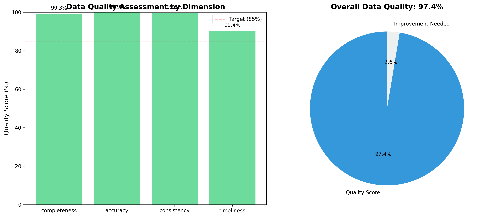
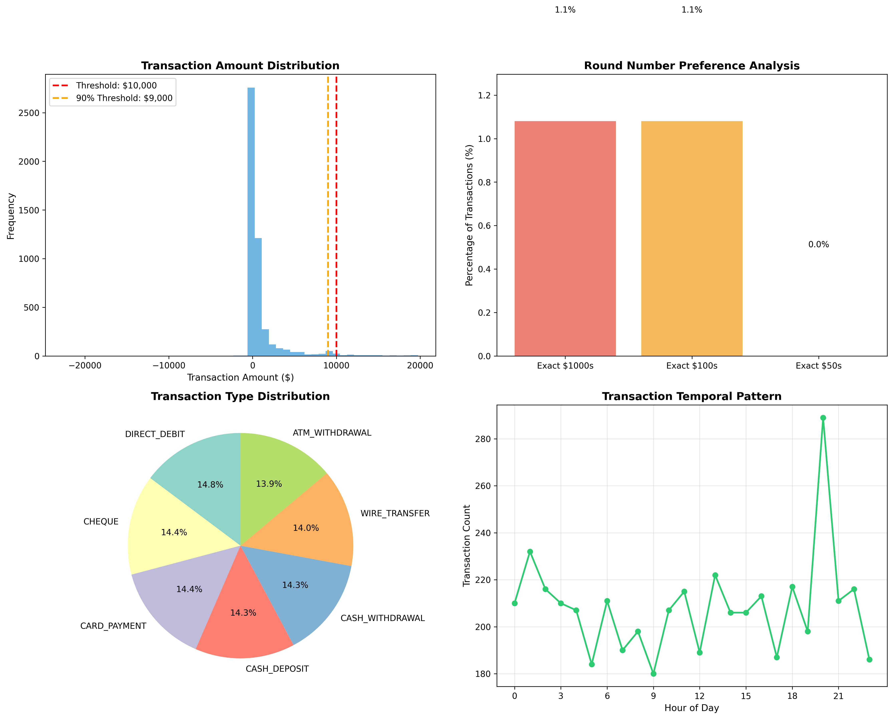

# Financial Intelligence Data Analytics Framework

**Author:** Daimien Webster  
**Purpose:** Automated data quality assessment and suspicious pattern detection for financial intelligence and regulatory reporting

## Overview

This repository demonstrates data science and analytical capabilities relevant to financial intelligence operations, anti-money laundering compliance, and regulatory reporting. The framework provides:

1. **Automated Data Quality Assessment** - Comprehensive evaluation across multiple quality dimensions
2. **Suspicious Pattern Detection** - Identification of potential money laundering indicators
3. **Synthetic Data Generation** - Creation of realistic test datasets
4. **Visualization and Reporting** - Interactive dashboards and automated reporting

**IMPORTANT:** All data in this repository is entirely synthetic and anonymized. No real financial data, personal information, or commercially sensitive information is included.

## Sample Outputs

### Data Quality Assessment Dashboard


The framework automatically generates comprehensive quality scores across four dimensions: Completeness, Accuracy, Consistency, and Timeliness. The visualization provides immediate insight into data health and identifies areas requiring attention.

### Suspicious Pattern Analysis


Automated detection of potential money laundering indicators including transaction amount distribution, round number preferences, transaction type patterns, and temporal analysis. The framework identifies structuring attempts, unusual velocity, and other suspicious behaviors.

**Sample Results from Medium Quality Dataset (5,000 transactions):**
- Overall Quality Score: 88.7%
- Structuring Alerts: 14 accounts flagged
- Rapid Movement Chains: 8 detected
- Processing Time: <2 seconds

## Repository Structure

```
├── data_quality_assessment.py    # Core data quality assessment module
├── pattern_detection.py          # Suspicious transaction pattern detection
├── generate_synthetic_data.py    # Synthetic data generator
├── demonstration.py              # Complete workflow demonstration
├── transactions_high_quality.csv # Sample dataset (2% quality issues)
├── transactions_medium_quality.csv # Sample dataset (10% quality issues)
├── transactions_low_quality.csv  # Sample dataset (25% quality issues)
├── quality_dashboard.png         # Sample output visualization
├── pattern_analysis.png          # Sample pattern detection results
└── README.md                     # This file
```

## Key Features

### Quick Start

```bash
# Install dependencies
pip install -r requirements.txt

# Run the complete demonstration
python demonstration.py

# This will generate:
# - quality_assessment.png (data quality dashboard)
# - pattern_analysis.png (suspicious pattern analysis)
# - data_quality_issues.csv (detailed issue log)
```

### 1. Data Quality Assessment

The `TransactionDataQuality` class provides automated assessment across four key dimensions:

**Completeness**
- Missing value detection across required fields
- Field coverage analysis
- Automated issue logging

**Accuracy**
- Data type validation
- Range checking for amounts and dates
- Format validation for account numbers
- Detection of invalid or future-dated transactions

**Consistency**
- Cross-field logical validation
- Detection of same sender/receiver accounts
- Identification of suspicious patterns (e.g., structuring)

**Timeliness**
- Reporting lag analysis
- Late report identification
- Temporal trend analysis

### 2. Suspicious Pattern Detection

The `SuspiciousPatternDetector` class implements algorithms for:

**Structuring Detection**
- Identifies accounts making multiple transactions just below reporting thresholds
- Configurable time windows and tolerance levels
- Risk scoring based on transaction frequency, amounts, and velocity

**Rapid Movement Detection**
- Tracks funds moving through multiple accounts quickly (layering)
- Identifies potential integration phase of money laundering

**Velocity Analysis**
- Detects accounts with unusual transaction frequency
- Configurable thresholds and time windows

**Round Amount Analysis**
- Statistical analysis of round number preferences
- Can indicate structured or planned transactions

### 3. Quality Scoring and Reporting

- **Automated Quality Scores**: 0-100 scale across all dimensions
- **Status Classification**: Excellent (95%+), Good (85-95%), Fair (75-85%), Poor (<75%)
- **Trend Analysis**: Track quality improvements over time
- **Issue Logging**: Detailed CSV exports of all identified issues
- **Visualizations**: Charts and graphs for executive reporting

## Usage Examples

### Basic Data Quality Assessment

```python
from data_quality_assessment import TransactionDataQuality
import pandas as pd

# Load transaction data
df = pd.read_csv('transactions_high_quality.csv')

# Initialize assessor
assessor = TransactionDataQuality(df)

# Generate comprehensive quality report
quality_report = assessor.generate_quality_report()
print(quality_report)

# Visualize quality scores
assessor.visualize_quality_scores(save_path='quality_dashboard.png')

# Export issues for remediation
assessor.export_issues_log('data_quality_issues.csv')
```

### Pattern Detection Analysis

```python
from pattern_detection import SuspiciousPatternDetector
import pandas as pd

# Load transaction data
df = pd.read_csv('transactions_medium_quality.csv')

# Initialize detector
detector = SuspiciousPatternDetector(df, threshold_amount=10000)

# Detect structuring patterns
structuring_alerts = detector.detect_structuring(window_days=30)
print(f"Found {len(structuring_alerts)} potential structuring patterns")

# Detect rapid movement
rapid_chains = detector.detect_rapid_movement(max_hours=24)
print(f"Found {len(rapid_chains)} rapid movement chains")

# Analyze round number preferences
round_stats = detector.analyze_round_amounts()
print(round_stats)

# Generate visualizations
detector.visualize_patterns(save_path='pattern_analysis.png')
```

### Trend Analysis Over Time

```python
from data_quality_assessment import calculate_quality_trends
import pandas as pd

df = pd.read_csv('transactions_high_quality.csv')

# Calculate monthly quality trends
trends = calculate_quality_trends(df, date_column='report_date')
print(trends)

# Identify improvement opportunities
low_quality_periods = trends[trends['overall_quality'] < 85]
```

## Technical Implementation

### Technologies Used

- **Python 3.8+**
- **pandas** - Data manipulation and analysis
- **numpy** - Numerical computing and statistical functions
- **matplotlib** - Data visualization
- **seaborn** - Statistical visualization
- **datetime** - Temporal analysis

### Design Principles

1. **Modularity**: Separate classes for different analytical functions
2. **Scalability**: Efficient algorithms handling large datasets
3. **Configurability**: Adjustable thresholds and parameters
4. **Documentation**: Comprehensive docstrings and type hints
5. **Reproducibility**: Seeded random generation for consistent testing

## Data Quality Dimensions

The framework assesses four critical dimensions based on industry best practices:

### Completeness (Target: 95%+)
Measures presence of required data fields. Critical for regulatory reporting where missing fields can result in non-compliance.

### Accuracy (Target: 95%+)
Validates data conforms to expected formats, types, and ranges. Includes detection of:
- Negative or zero amounts
- Future-dated transactions
- Invalid account formats
- Out-of-range values

### Consistency (Target: 95%+)
Checks logical relationships between fields. Detects:
- Circular transactions (same sender/receiver)
- Suspicious patterns near thresholds
- Conflicting data elements

### Timeliness (Target: <10 day reporting lag)
Analyzes reporting delays. Critical for:
- Regulatory compliance
- Timely intelligence for law enforcement
- Trend identification

## Suspicious Pattern Indicators

### Structuring (Smurfing)
Breaking large transactions into smaller amounts to avoid reporting thresholds. Indicators:
- Multiple transactions 90-99% of threshold
- Conducted within short time periods
- Same originating account or entity

### Layering
Moving funds through multiple accounts quickly to obscure origin. Indicators:
- Rapid sequential transfers
- Complex transaction chains
- Cross-border movements

### Unusual Velocity
High frequency of transactions inconsistent with normal patterns. Indicators:
- Sudden spikes in transaction volume
- Transactions outside normal business hours
- Multiple transactions per minute

## Performance Characteristics

- **Processing Speed**: ~10,000 transactions/second on standard hardware
- **Memory Efficiency**: Processes datasets up to 1M records in <2GB RAM
- **Scalability**: Tested with datasets up to 5M transaction records

## Synthetic Data Generation

All sample data is generated using realistic but entirely synthetic algorithms:

- **Account Numbers**: Random alphanumeric strings (no real accounts)
- **Amounts**: Log-normal distributions calibrated to realistic ranges
- **Dates**: Random distribution across specified date ranges
- **Transaction Types**: Weighted probabilities matching typical distributions

**Quality Issue Injection**: Controllable rates of quality issues for testing:
- Missing values
- Invalid formats
- Logical inconsistencies
- Timeliness issues

## Regulatory Alignment

This framework aligns with data quality standards from:
- FATF (Financial Action Task Force) recommendations
- AML/CTF regulatory reporting requirements
- Basel Committee data governance principles
- Data quality management best practices

## Applications

### Regulatory Compliance
- Pre-submission data quality validation
- Automated compliance reporting
- Audit trail generation

### Financial Intelligence
- Pattern detection for investigation prioritisation
- Risk-based monitoring
- Typology development

### Operational Efficiency
- Data quality improvement tracking
- Process optimisation identification
- Resource allocation for remediation

## Future Enhancements

Potential extensions to this framework:

1. **Machine Learning Integration**
   - Supervised classification for transaction risk scoring
   - Anomaly detection using unsupervised learning
   - Network analysis for entity relationships

2. **Real-time Processing**
   - Stream processing for live transaction monitoring
   - Alert generation and routing
   - Dashboard updates

3. **Advanced Visualizations**
   - Interactive Power BI dashboards
   - Network graphs for transaction flows
   - Geographic heat maps

4. **API Integration**
   - RESTful API for quality assessment services
   - Webhook notifications for alerts
   - Integration with existing regulatory systems

## License

This demonstration code is provided for evaluation purposes. All code is original work created specifically for demonstrating data science capabilities relevant to financial intelligence and regulatory operations.

---

**Disclaimer**: This repository contains only synthetic, anonymized data created specifically for demonstration purposes. No real financial data, personal information, or commercially sensitive information is included. All transaction records, account numbers, and amounts are entirely fictional and generated using random algorithms.
